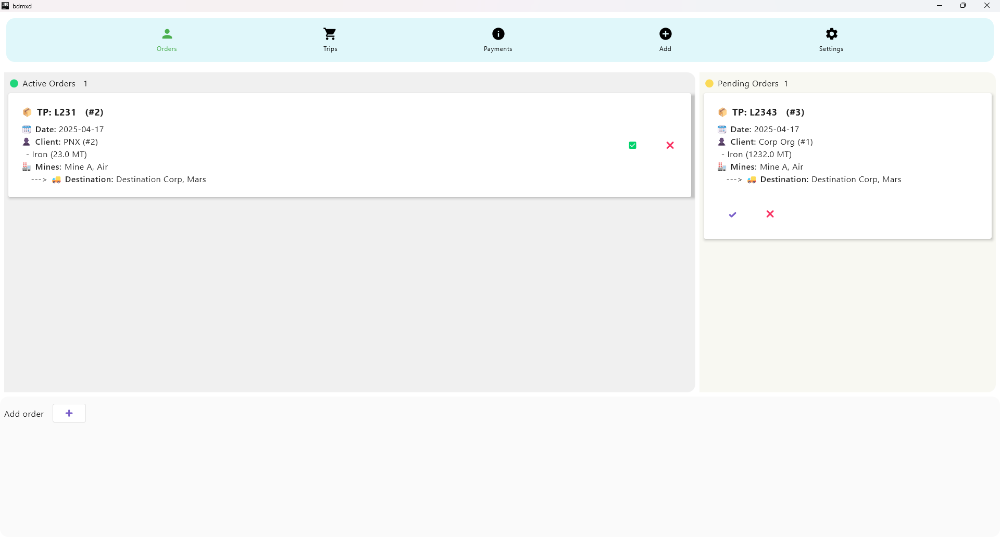
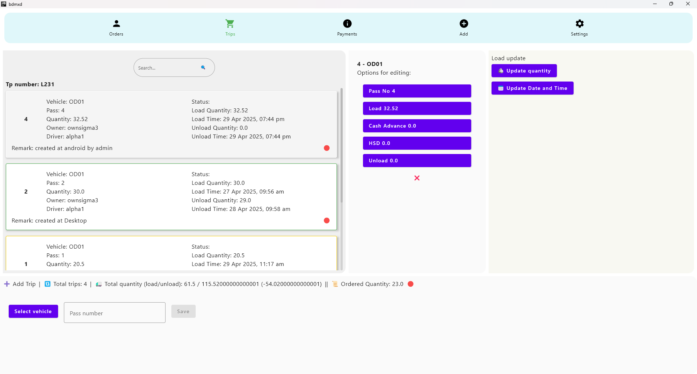
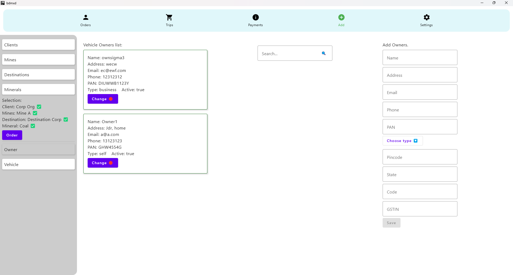

# 🖥️ BDMX Desktop App

A powerful and user-friendly desktop application built with compose to help users manage order and trips for bulk products.

---

## 🚀 Features

- ⚡ Fast and responsive UI
- 📁 Save/load files
- 🔒 Secure user preferences
- 🌐 Internet features
- 🧩 Modular and easy to extend

---

## 🛠️ Tech Stack

- Language: Java/Kotlin
- UI Framework: Jetpack Compose
- Packaging: JPackage / Jar

---

## 🖼️ Screenshots

| Home                           | Settings                          | Output                         |
|--------------------------------|-----------------------------------|--------------------------------|
|  |  |  |

---

